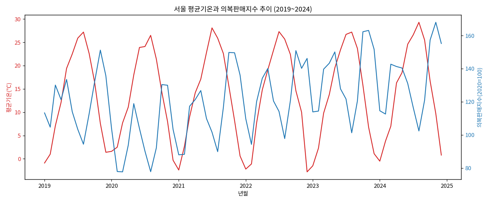
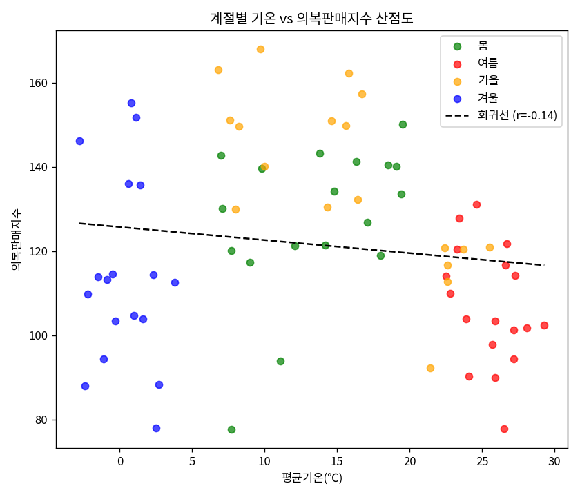
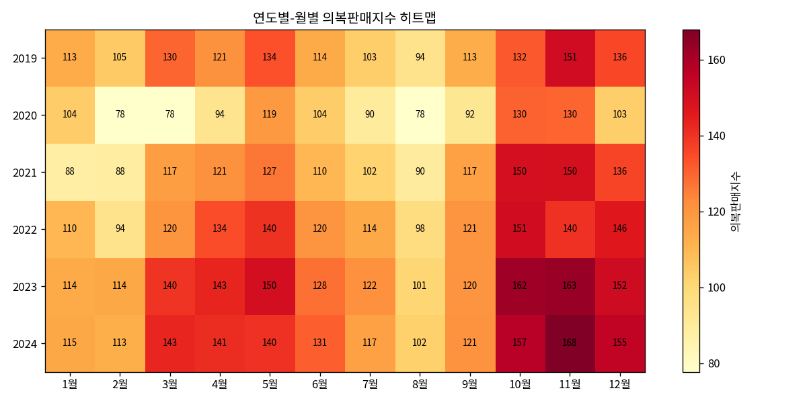

# 서울 기온이 의류소비에 미치는 영향 분석 리포트

## 1. 분석 주제 및 선정 이유

옷을 살 때 "날씨가 추워져서" 산다고 흔히 생각하지만, 실제로는 기온 자체보다 계절 감각(다가오는 계절에 대한 준비 행동)이 구매를 더 크게 움직일 수도 있다는 가설을 데이터로 확인해보고자 했다.

이를 위해 **서울 평균기온**, **의복 소매판매지수**, **네이버 계절 의류 검색량(겨울옷/여름옷/봄옷)** 세 시계열을 2019~2024년(72개월) 동안 겹쳐 보고, 기온과 검색행동 중 어느 쪽이 실제 구매(판매지수)와 더 강하게 연결되는지를 살펴본다.

## 2. 분석 질문

1. 서울의 월평균 기온과 의복 소매판매지수는 함께 오르내리는가, 아니면 시차나 어긋남이 있는가?
2. 기온과 '겨울옷/여름옷/봄옷' 검색량 중 어느 쪽이 의복판매지수와 더 강한 상관을 보이는가?
3. 연중 의복판매지수가 가장 높은 시기와 가장 낮은 시기는 언제이며, 그 격차는 얼마나 큰가?
4. 2020년(코로나19 확산 초기)은 다른 해와 다른 패턴을 보이는가?

## 3. 데이터 설명

| 데이터 | 출처 | 기간 | 단위 | 비고 |
|---|---|---|---|---|
| 기온 | 기상청 기상자료개방포털 (서울, 지점 108) | 2019.01~2024.12 (월평균) | ℃ | 자료구분 '월'로 직접 수집(72행) |
| 의복 소매판매지수 | KOSIS 국가통계포털 | 2019.01~2024.12 | 지수(2020=100) | '의복' 행, '경상지수' 컬럼만 사용 |
| 계절 의류 검색량 | 네이버 데이터랩 | 2019-01-01~2024-12-31 (일별→월평균 변환) | 상대지수 | 겨울옷/여름옷/봄옷 3개 키워드 |

데이터 포인트 수: 통합 후 **72개월 × 3개 데이터군**으로 미션 최소 기준(100개 이상)을 충족한다(검색량은 변환 전 원자료 기준 일별 약 2,192개 포인트).

### 데이터 정제

- 기온: 기상청 웹 UI의 일별 다운로드가 스크롤 슬라이더로 인해 일부만 저장되는 문제가 있어, 연도별로 '월' 단위 자료를 6회 나누어 받아 72행으로 병합했다. 병합 후 중복·누락 월이 없음을 확인했다.
- 검색량: 원본이 일별(약 2,192행)이라 `년월` 기준으로 `groupby().mean()`하여 월평균으로 변환했다.
- 의복판매지수: 원본이 가로형(월이 열 방향, 경상지수/불변지수/계절조정지수 3열 반복)이라 '의복' 행만 추출하고 '경상지수' 열만 세로형으로 변환했다.
- 세 데이터를 `년월` 기준 inner join으로 병합한 결과 72행 모두 결측치 없이 매칭되었다(별도 이상치 제거는 하지 않음 — 극값도 계절 특성을 반영하는 실제 값으로 판단).

## 4. 적용한 시계열 분석 기법

- **3개월 이동평균**: 월별 등락의 노이즈를 줄이고 추세를 보기 위해 적용
- **전월 대비 증감률(%)**: 급등/급락 구간을 포착하기 위해 적용
- **Pearson 상관분석 + p-value**: 기온/검색량과 판매지수 간 관계의 강도와 통계적 유의성을 함께 확인

## 5. 시각화

### 시각화 1. 기온 & 의복판매지수 이중축 시계열


두 곡선 모두 뚜렷한 연간 사이클을 보이지만, 기온 곡선의 정점(7~8월)과 판매지수 곡선의 정점(10~11월) 사이에 약 2~3개월의 시차가 있다.

### 시각화 2. 계절별 기온 vs 의복판매지수 산점도 + 회귀선


전체 회귀선의 기울기는 완만한 음(-)의 방향이며 결정력이 낮다(r=-0.14). 계절별 색상을 보면 겨울(파랑)은 기온이 낮은 구간에서도 판매지수가 위아래로 넓게 퍼져 있어, 기온만으로 설명되지 않는 변동이 크다는 것을 보여준다.

### 시각화 3. 연도별-월별 의복판매지수 히트맵


10~11월(진한 빨강)에 매해 반복적으로 최고점이 나타나고, 8월(연한 노랑)에 최저점이 나타난다. 2020년 행 전체가 다른 해보다 옅은 것도 눈에 띈다.

## 6. 인사이트

**인사이트 1. 기온보다 '겨울옷' 검색행동이 구매와 더 강하게 연결된다**
- 관찰(Fact): 평균기온과 의복판매지수의 상관은 r=-0.139(p=0.243, 유의하지 않음)인 반면, '겨울옷' 검색량과 의복판매지수의 상관은 r=0.439(p<0.001, 유의)로 뚜렷이 강하다. '여름옷'(r=-0.130, p=0.277), '봄옷'(r=0.025, p=0.837)은 유의한 상관이 없었다.
- 원인(Why): 옷 구매는 "오늘 기온이 몇 도인가"보다 "겨울이 다가오고 있다"는 계절 인지·선제적 준비 행동과 더 맞물려 있을 가능성이 있다. 다만 상관은 인과를 증명하지 않으므로 가설로만 제시한다.
- 행동(Action): 마케팅/재고 타이밍을 "기온 예보" 대신 "계절 검색 트렌드"에 맞춰보는 실험을 고려할 수 있다. 추가로 일별 데이터를 이용한 시차상관(lag correlation) 분석을 해보면 더 명확해질 것이다.

**인사이트 2. 판매지수는 가을(9~11월)에 정점, 여름(6~8월)에 저점을 반복한다**
- 관찰(Fact): 6년 평균 계절별 판매지수는 가을 137.2, 봄 127.4, 겨울 114.7, 여름 106.6이다. 특히 11월은 매년 최고 구간(2024년 168.0으로 전체 기간 중 최고치)에, 8월은 매년 최저 구간에 위치했다.
- 원인(Why): 가을은 겨울옷(패딩·코트 등 상대적 고단가 품목) 선구매 시즌과 신상품 출시가 겹치는 시기로, 판매 '금액' 지수를 밀어올리는 것으로 보인다. 반대로 여름은 의류 단가 자체가 낮고 구매 빈도도 상대적으로 낮은 경향이 있다.
- 행동(Action): 재고·프로모션 계획 시 9~11월을 성수기로, 6~8월을 비수기로 명확히 구분해 대응할 필요가 있다.

**인사이트 3. 2020년(코로나19 확산 초기)은 전년 대비 전 월에 걸쳐 판매지수가 하락했다**
- 관찰(Fact): 2020년 평균 판매지수는 100.0으로 2019년(120.6) 대비 -20.5p 낮았다. 특히 2020년 3월은 전년 동월 대비 -52.4p로 가장 큰 낙폭을 보였고, 이는 6년 전체 데이터 중 최저치(77.7)이기도 하다.
- 원인(Why): 2020년 3월은 국내 코로나19 확산과 개학 연기·외출 자제가 맞물린 시점으로, 신학기 및 봄 의류 구매 수요가 위축되었을 가능성이 있다.
- 행동(Action): 2020년을 이상치로 제외하기보다는 "외부 충격 이벤트"로 별도 표시(더미변수 등)하여 추세 분석 시 왜곡을 줄이는 방법을 다음 분석에서 고려할 수 있다.

**(참고) 기각된 가설 — 검색량의 선행지표 효과**
- 겨울옷 검색량(당월)이 다음 달 판매지수를 예측하는지 확인했으나 상관이 거의 없었다(r=0.087, p=0.473). 즉 검색과 구매는 월 단위로 시차를 두고 이어지기보다, 같은 달 안에서 함께 움직이는 것으로 보인다(또는 월 단위 집계로는 며칠 단위의 짧은 시차가 가려질 수 있다).

## 7. 결론 및 한계점

**결론**: 당월 기온 자체는 의복판매지수를 잘 설명하지 못했다(유의하지 않음). 반면 '겨울옷' 검색량은 판매지수와 유의한 양의 상관을 보였고, 판매지수는 매년 가을에 정점·여름에 저점을 이루는 뚜렷한 계절성을 가진다. 2020년은 코로나19로 추정되는 전반적 하락이 관찰된다.

**한계점**:
- 상관분석은 인과관계를 증명하지 않는다. 소득, 프로모션·할인, 온라인 쇼핑 확산 등 다른 요인을 통제하지 못했다.
- 의복판매지수는 '금액' 기준 경상지수라 실제 구매 수량이 아닌 물가 변동의 영향도 섞여 있을 수 있다.
- 검색량 데이터는 네이버 한 플랫폼, 3개 키워드로 한정되어 전체 소비자 행동을 대표하지 못할 수 있다.
- 월 단위 집계로 인해 며칠 단위의 짧은 시차 효과는 관찰하지 못했을 가능성이 있다(일별 시차상관 분석은 다음 과제로 남김).

## 8. AI 사용 로그

| 사용 작업 | 사용 이유 | 검증 방법 |
|---|---|---|
| 데이터 전처리 코드 작성 (인코딩 처리, 가로형→세로형 변환, 월별 집계) | 3개 데이터 소스의 형식이 제각각이라 직접 짜면 시간이 오래 걸려 시간 절감을 위해 활용 | 각 STEP 실행 후 `.shape`, `.isnull().sum()`, `.head()`로 행 수·결측치·값 범위를 직접 확인 |
| 시각화 코드 작성 (이중축 시계열, 산점도+회귀선, 히트맵) | 세 가지 이상 시각화를 빠르게 시도해보기 위해 활용 | 생성된 이미지를 직접 열어 육안으로 축·범례·수치가 데이터와 맞는지 확인 |
| 상관분석·이동평균·증감률 계산 코드 작성 | 통계 기법 적용 코드의 정확성과 시간 절감을 위해 활용 | `scipy.stats.pearsonr` 결과를 pandas `.corr()` 결과와 교차 확인, 이동평균/증감률은 수기로 2~3개 값 직접 재계산해 대조 |
| 인사이트 해석 초안 작성 | 관찰된 수치를 관찰(Fact)-원인(Why)-행동(Action) 형식으로 정리하는 데 활용 | 제시된 해석이 실제 데이터 수치와 일치하는지, 과도한 인과 주장이 없는지 직접 검토·수정 |

## 9. 재현 방법

```bash
pip install pandas numpy matplotlib scipy
jupyter notebook analysis.ipynb
```

`data/` 폴더에 `기온_월별.csv`, `검색량.csv`, `의류판매.csv`가 있어야 하며, 실행 결과 이미지는 `charts/` 폴더에 저장된다.
